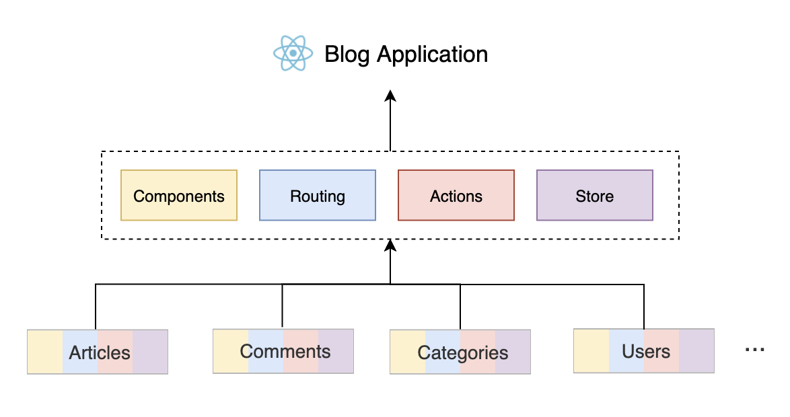
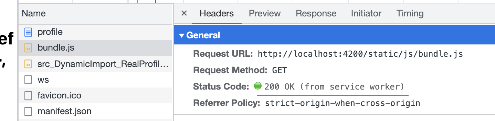
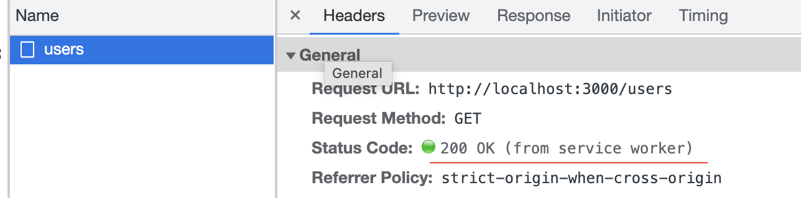

# React Hooks
## Hook Basics
- reusable logic
- single responsibility
### Custom Hooks Scenario
- Extract business logic
- Listen on browser : useScroll / useCookies / useLocalStorage
- divide complex component into hooks
- Encapsulate generic logic : useAsync
#### useAsync to encapsulate different request states and expose them to be used by component
```js
const useAsync = (asyncFunc)=>{
    const [data, setData] = useState(null); 
    const [loading, setLoading] = useState(false); 
    const [error, setError] = useState(null);
    const execute = useCallback(()=>{
        setLoading(true)
        asyncFunc().then(response=>{
            setData(response)
            setLoading(false)
        }).catch(err=>{
            setLoading(false)
            setError(err)
        })
    },[asyncFunc])
    return {data,loading,error,execute}
}
```
## Redux
### Redux Store
- Global unique
- Tree structure
### Redux Usage
- Share states across components
- Share states across multiple instances from one component
### Basic Concepts
- state/store, pure JS object
- action, pure js object
- reducer, a function accepts state and action as params, get a new Store from calculation

- Every change for Store should use reducer 
  - Immutable
  - Predictale
  - Easy to track and debug

## React Redux

- In practice, we don't need care about how View is bind to data from Store, react-redux do this for us.

### Redux [Async Action](https://redux.js.org/understanding/thinking-in-redux/glossary#async-action)
- Mainly for processing async logic.
- Async action is not a specific concept,it's a usage of Redux by combining actions to implement async data processing, and without adding any new concept.
- A Redux action can be anything, an object or a function. By using this mechanism, Redux provides redux-thunk as middlware. If the middleware receives a function as a params, it will run this function by passing into dispatch, before passing to reducer. So that you can device when and how to dispatch action.


### reusabe fetchData by Async Action: [useAsync](#useasync-to-encapsulate-different-request-states-and-expose-them-to-be-used-by-component)
- How to fetch data in general way ? 
  - Normally need 3 actions : fetching/loading;fetched/success;fetched/failed;
    - dispatch({ type: 'FETCH_DATA_BEGIN' });
    - dispatch({ type: 'FETCH_DATA_SUCCESS', data: res });
    - dispatch({ type: 'FETCH_DATA_FAILURE', error: err });
  - Combined with 3 selectors
    - const data = useSelectore(state => state.data); 
    - const pending = useSelector(state => state.pending); 
    - const error = useSelector(state => state.error);
- [Make fetchData(thunk) reusable by Async Action in Redux](https://redux.js.org/tutorials/fundamentals/part-6-async-logic)
  - Set up redux-thunk: [Thunks](https://redux.js.org/usage/writing-logic-thunks) are typically used to make async request.[Config store which includes middleware](https://redux.js.org/usage/configuring-your-store#the-solution-configurestore)
    ```js
    //set up redux-thunk to store
    import { createStore, applyMiddleware } from 'redux'
    import thunkMiddleware from 'redux-thunk'
    import rootReducer from './reducer'

    const composedEnhancer = applyMiddleware(thunkMiddleware)
    const store = createStore(rootReducer, composedEnhancer)
    ```
  - [Create thunk by using createAsyncThunk or by hand](./basics/my-react-redux-app/src/features/counter2/counter2Slice.js)
  - Thunk can combinding actionsn in async function
    ```js
    //create a thunck by hand, combining actions in async function
    const fetchData = ()=>(dispatch)=>{
      dispatch({ type: 'FETCH_DATA_BEGIN' }); 
      fetch('/some-url')
        .then(res => { 
            dispatch({ type: 'FETCH_DATA_SUCCESS', data: res }); 
          })
        .catch(err => { 
            dispatch({ type: 'FETCH_DATA_FAILURE', error: err }); 
          })
      }
    ```

# React Hook Practices
> Develop React is actually for developing and managing states in application:
> - Keep states minimum
>   - do not think of state as a variable so that abuse it
>   - should keep it minimum but with completeness
>     - data can be calculated from existing state, we should calculate it as needed, withoiy save the calculate result into some existing state.
>  - steps to think about state
>     1. how many states the entire funtion should have
>       - data from API?
>       - inputs from User?
>       - filtered/processed data based on inputs
>     2. does those states are all necessary ? if there some of them can be get by calculating
> - avoid intermediate state, make sure single data source. Find the correct source of state and ues it directly,without creating extra state. More states interact with each other, more logic to handle them.
> Nature of React is state driven.[state change -> makes UI change](#react-redux)

## React controlled components vs uncontrolled
> React controlled Component 
 * Its value determited by passing value, instead of user inputs.
 * To be able to fully control elements in React, some elements' react events are a little bit different from DOM element. e.g. input's React onChange will be triggered bby every typing, instead of losing focus like its DOM onchange event. Cons is may cause unnecessary render.
 * Controlled component is frequently used in React than uncontrolled, unless in some scenarios need high performance.
 * we can easily use hook to [value, setValue] controlled component.

```js
<input value={value} onChange={handleChange} />
```

> React uncontrolled Component
 * Has its own internal state, its displaying value isn't controled by React.
 * It isn't cause unnecessary render, since component isn't "changing" when typing from React perspective.

```js
<input onChange={handleChange} />
```
## handle API request with Hook
### Create APIClient to handle API calls 
Need implement a resusable API client, instead of calling APIs using fetch/Axios in every single component, which is handy for:
- General Request Headers : Auth token
- Server URL config : API client should be able to choose correct URL depends on env the APP is runing on
- Exception handle :  e.g. UnAuth/Token expire/General Error

Implement API client Based on [Axios](https://github.com/axios/axios) is better then fetch, which has more convinient/readable API, e.g. request interceptor, easier to create multiple instances, keeps code clean.

### Use Hook to wrap GET request by using APIClient
<p>one of features of Hook is we can use hook to "hook" any data source to a React component. GET request is a good example, we can regard response from GET is a remote data source,which can be encapsulated into a hook.</p>

- data : sucessful response data;
- error : failure message;
- pending : after request sending out,before response coming back, in this period, it's pending;

with thiose 3 states, we can easily show loading, error or data.


### Why use hook to wrap every individual GET API request, instead of a general hook, e.g. useRemoteData ?
- We don't have to, but we need keep a hook as simple as possible. 
- General, we need do additional work to process data from API for showing on UI, and every request may have different logic to process, allowing a little bit duplicated code, we can avoid produce too much complex logic. 
- Meanwhile, sometimes we need construct a remote data source by multiple requests, wrap every GET request to individuel hook makes logic more clear.
- One single GET request - one hook only applies to GET request, for other types of request, we can use a general hook follows same methodology as GET hook(encapsulate different states of a request and expose to be used by Component).[See useAsync](#useAsync-to-encapsulate-different-request-states-and-expose-them-to-be-used-by-component)

### handle multiple API request (concurrence and serialization)
Come back to the nature : state drive UI. We can use state change to manage request. Every render provide a chance to do something based on state change. So that we can use different state combination to implement async request.

Consider requirements below:
- Get article details
- Get author's details of article
- Get article comment

Implementation
1. : concurrence and serialization Requests in useEffect
- Get article details and comment are concurrence, as long as get article ID
- Get aritcle details and its author's details as serialization, need get author's ID from article details first
- React function component is sync, we can't use "await", we should useEffect instead.

2. : React Render
- First render only has ID at this time - 2 useEffect to get ariticle details and comments, no authorId yet, not trigger author details api
- After article details coming back, use autherId to fetch auther detaisl in useEffect
- Display author details

Obviously, useEffect above all triggered by data(articleId->articleDetails/articleComment;articleDetails/articleId->authorDetails)
> Summary:怎么从 Hooks 的角度去组织异步请求。
> 首先，我们要定义一个自己的 API Client，封装整个应用中异步请求的一些通过设置，以及统一处理，方便在 Hooks 中使用。
> 然后，我们需要充分利用 Hooks 能让数据源变得可绑定的能力，让一个远程 API 对应的数据成为一个语义化的数据源，既可以把业务逻辑和 UI 展现很好地分开，也有利于测试和维护。
> 最后呢，针对多请求的处理，利用状态的组合变化来实现并发和串行请求。

### What if sometimes need component get data automatically, sometimes need get data by clicking button ? How to re-design useArticle hook?
1. Add a toggle parameter to hook for trigger fetch automatically or not.
2. Return a execute function from the hook to let component to trigger fetch as needed at any time.

## Design pattern in function component
### Container pattern - use hooks conditionally
To Solve : In some cases, don't want to fetch data if invisible, but Hooks can't be used in conditional statement
```js
function UserInfoModal({ visible, userId, ...rest }) {
  if (!visible) return null;
  const { data, loading, error } = useUser(userId); //Syntax Error
  return (
    <Modal visible={visible} {...rest}>
      {/* Modal Content */}
    </Modal>
  );
};
```
Use a component wrapper to do condition check, make sure UI-render-component always accept non-null values
```js
function UserInfoModalWrapper({ visible, ...rest }) {
  if (!visible) return null;
  return <UserInfoModal visible {...rest}/>;
};
//Practically, not just one condition : visible, more frequently, will be a combinantion of props for checking.
```

- pros : keep each component simple and short, at least don't have to write some conditional statement, readale and easy to maintain
- cons :  Not straightforward
- usage : Conditional check mainly for seperate child-components, so Container pattern is used to seperate large logic chunks. To check specific details, we can put conditional check into Hooks, e.g. useAuthor
```js
const useAuthor = (authorId)=>{
  const [data,setData] = useState(null);
  const [error,setError] = useState(null);
  const [loading,setLoading] = useState(false);
  useEffect(()=>{
    if(!authorId){
      return //do nothing
    }
    ....
  },[authorId])
  return {
    data,
    error,
    loading
  }
}
```
### Render Props(reuse UI logic) with Hook
#### Render Props & HOC
Render props and HOC are 2 main methord in Class component, in reality, every scenario uses HOC can use Render Props instead.
- Render Proprs: pass render function(function component) as a prop to child component, let child component to call it for rendering.apply for both class and function component
- HOC: [a function that takes a component and returns a new component](https://reactjs.org/docs/higher-order-components.html)

#### Render Props & Hook
Hooks is the first choice of logic reusable. But hooks can only reuse data logic, we need Render Props to reuse UI logic.
```js
//Hook Example for reusing counter data logic
function useCounter() {
  // 定义 count 这个 state 用于保存当前数值
  const [count, setCount] = useState(0);
  // 实现加 1 的操作
  const increment = useCallback(() => setCount(count + 1), [count]);
  // 实现减 1 的操作
  const decrement = useCallback(() => setCount(count - 1), [count]);
  
  // 将业务逻辑的操作 export 出去供调用者使用
  return { count, increment, decrement };
}
```
```js
//Render Props Example for reusing counter UI logic 

function CounterRenderer({ children }) {
  const [count, setCount] = useState(0);
  const increment = useCallback(() => {
    setCount(count + 1);
  }, [count]);
  const decrement = useCallback(() => {
    setCount(count - 1);
  }, [count]);

  return children({ count, increment, decrement });
}
function Counter() {
  return (
    <CounterRenderer>
      {({ count, increment, decrement }) => {
        return (
          <div>
            <button onClick={decrement}>-</button>
            <span>{count}</span>
            <button onClick={increment}>+</button>
          </div>
        );
      }}
    </CounterRenderer>
  );
}
```
## React Event with Hook
### 2 kinds of Event In React
1. DOM Event (Camel Case in React)
   1. Methodology : [Synthetic Events](https://reactjs.org/docs/events.html), acturally it's leverage Browser's DOM Event propogate mechanism. 
      1. With virtual DOM, every Event is binded to ROOT Node(document React 17 before, App Root Node after React 17), With DOM Event propogate mechanism, React is be able to know which Node triggers Event by checking srcElement, and collect/manage every event, then expose them by common API
      2. Pros : In case when rendering virtual DOM, DOM has't been rendered to the page, can't bind events at this point
      3. Props : shield the details of the underlying event, avoid browser compatibility, even for React Native which not render on browser, still is able to provide common API.
   2. If callback function is binded to a DOM element, no different on performance for useCallback to wrap it.
   3. If callack funtion is used on Custom Component, need useCallback to reduce unnecessary rendering.
2. Custom Event
   1. Methodology : Components own behavior, no thing relates to Browser, actually it's a callback mechanism.
### Use hook to simple process of React Event
- [use hook to handle single KeyPress Event](./practices/EventAndForm/src/features/Events/useKeyPress.js)
- [use hook to handle multiple KeyPress Events](./practices/EventAndForm/src/features/Events/useKeysPress.js)

## Project Structure
> Where does project complexity come from ? 
**Dependencies**
1. Create folders based on **Business funcationality(feature)**
  * Each folder has its components, actions, hooks, styles 
  * Keep folder flatten, avoid create deeper sub folders

2. Figure out Business dependences bewteen features, before implementation
  * Hard dependence - comments hard depends on article, it can't work without article 
  * Soft denpendence - article soft denpends on comments, it still works without comments
3. Technically, aiming to delete a feature just like deleting a folder. **Do not let article hard depends on comments**. Bad example below, it's hard to add more functionalities(like,gallary) to ArticelView.
  ```js
  import CommentList from './CommentList';
  function ArticleView() {
    return (
      <div className="article-view">
        <MainContent />
        <CommentList />
      </div>
    );
  }
  ```
  * [Extension point](https://github.com/rekit/js-plugin): similar with events suscribe/dispatch mechanism.
  ```js
  function ArticleView({ id }) {
    const { article } = useArticle(id);
    return (
      <div className="article-view">
        <MainContent article={article} />
        <Extension name="article.footer" args={article} />
      </div>
    );
  }
  extensionEngine.register('article.footer', article => {
    return <CommentList article={article} />
  });
  ```
  * Avoid to make a nav menu contains all features' nav logics
  * Avoid to make a module contains all routes.
  * Manage complexity should always keep in mind.

## React Form with Hook
> Form is a combination of UI management and state management. Hooks help to keep the state management, allow components to only handle UI part. 
- Most form field component is [controlled component](#React-controlled-components-vs-uncontrolled), so that we can use hook to keep their states.[useForm](./practices/EventAndForm/src/features/Form/useForm.js)
- General Form Libs - all in same methodology : sperate form states logic from UI logic
  * Ant Form
    * provide form state management, UI supports as well, e.g. form layout, error display, mostly combined with Ant Design
  * [Formik](https://formik.org/)
    * Render props to reuse form state logic :  passing all form states into childComponent(...props) which is for UI logic.
  * [React Hook Form](https://react-hook-form.com/)
    * uncontrolled component to manage form elements, avoid duplicated render, good performance in complex form elements.

## React Modal with Hook
> Typically, Modal always inserted into Root Component for sharing by other child component.e.g. Root-Container includes UserList, Sidebar, and NewUserModal; UserList use NewUserModal for editing,Sidebar use it for adding. While adding other component to root which also needs NewUserModal, or subComponents of Sidebar/UserList also need use it, those make the Root container becomes more complex, unable to achieve semantic isolation.

> Solution is using global modal mangagement methodology to generate modal and control its states, combine with Redux to keep states. While for some modals only need to be used once, we still can use the typically way to insert them to Root.

- [Global Modal using Redux to store modal's states](./practices/Modal/src/features/NiceModal-Redux/NiceModal/NiceModal.js)
- [Global Modal using Context to provide modals states and comsumed by nested component](./practices/Modal/src/features/NiceModal-Context/NiceModal/NiceModal.js)
- [Global Modal using useContext and useReducer to manage state by dispatch/action, same logic as Redux. Normally, useReducer is combined with useContext to deal with complex data logic.(Could replace redux to a certain degree)](./practices/Modal/src/features/NiceModal-Context-Reducer/NiceModal/NiceModal.js)

## React Router
> Metheodology : Router decides which component to be rendered based on URL.
> [Toy Router](./practices/Router/src/features/ToyRouter/ToyRouter.js). 
> [React Router](https://reactrouter.com/docs/en/v6/examples/basic).


> Remember Router is dynamical, it can be changed dynamically.
<p>Usage of Router<p>

- Navigaetion :  [Nested Router](./practices/Router/src/features/NestedRouter/Overview.js)
- Keep page state:  [Keep page states in URL for sharable](./practices/Router/src/features/SharingPageStates/Overview.js)
  * Keep states in URL (manipulate URL directly, instead of creating new state for keeping activeTab/currentPage).
- Permission check : [Router Auth](./practices/Router/src/features/RouterAuth/Overview.js)
  * Put permission check on Router level, instead of put into business logic, easier for maintain.

# Speed up application - reduce loading time
> 2 points : Load on demand; Efficient cache, only load once for same resource.
## Import/Load on Demand in React
- [Dynamic Import](https://developer.mozilla.org/en-US/docs/Web/JavaScript/Reference/Statements/import#dynamic_imports) which supported by [most browsers](https://caniuse.com/es6-module-dynamic-import) 
  * Different from static import : <code>import xxx from '...'</code>, import() will return a promise.
  * No being standard in ES, but bundlers e.g. Webpack implemented.
  * Steps:
    * Create a loader component and use it anywhere needs real component.
    * Import real component inside loader component.
    * loader component handles loading, error for UE.
- [react-loadable](https://github.com/jamiebuilds/react-loadable) implements dynamic import steps by HOC
- React Lazy, same methodology as react-loadable, react-loadable has richer API options.

## Cache resources - Service Worker + [Cache Storage](https://developer.mozilla.org/en-US/docs/Web/API/CacheStorage)
> Service worker isn't only used with PWA for offline application, but also can be used with localStorage for cache.

> [We can regard service worker as a request agent](./public/service-worker-as-request-agent.png)

### With Service Worker + Cache Storage
- Cache never expires, as long as loaded once, never needs load again, unless delete them manually.
- Never visit resources which expires. If new version pulished, versioning resources to make sure user always access new version.

### How to Use Service Worker + Cache Storage
>[Service Worker](https://developer.mozilla.org/en-US/docs/Web/API/Service_Worker_API) 是一段独立于页面之外的 JavaScript 脚本，它并不在 Web 页面中运行，但是会在 Web 页面加载时，由一段代码去触发注册、下载和激活。一旦安装完成之后，Service Worker 就会拦截所有当前域名下的所有请求，由代码逻辑决定应该如何处理。
> Cache Storage 也是浏览器提供的一种缓存机制，专门用于缓存一个请求的 request 和 response 的配对关系。此外，它还提供了 API，用来判断某个 request 是不是有对应的 response 已经缓存。所以 Cache Storage 也可以认为是专门为 Service Worker 提供的缓存机制。有了这样一段代码，我们就完成了 Service Worker 的安装。需要特别注意的是，每次打开 Web 页面时，页面其实都会调用 Service Worker 的 register 方法去注册。但是浏览器会判断脚本内容是否有变化，只有发生了变化才会重新安装。

- Register in index.js and put sw.js to public folder
- [Install](https://developer.mozilla.org/en-US/docs/Web/API/Service_Worker_API/Using_Service_Workers#install_and_activate_populating_your_cache) ServiceWorkder in sw.js
- Handle request - [listening fetch event in SW](./practices/LoadPerformance/public/sw.js)
  * static bundle.js 
  * GET response 

# Packaging
## Webpack
- Loader(process resources) : convert different types of resources to modules.e.g. less-loader converts less to css;css-loader process css statements(import, url, etc.) to extract static resources(imgs,etc) and output css modules; style-load generate js includes css code automatically, insert css to style tag when app is runing(injectStylesIntoStyleTag).
- Plugin(additional process on processed resources) : if you want to output an index.html after packaging('html-webpack-plugin'); or keep css seperate from js, removing style-loader and use mini-css-extract-plugin which recognize all css modules and generate them as one css file.

```js
  plugins: [
    // 使用 HtmlWebpackPlugin 生成一个 index.html，其中自动引入 js    
    // 并配置了页面的 title    
    new HtmlWebpackPlugin({      title: 'Webpack Output',    }), 
    // 引入提取 CSS 的插件以及参数 
    new MiniCssExtractPlugin({ filename: 'static/css/[name].[contenthash:8].css', })
  ],
```

# Unit Test
## Test Framework
> Need 2 kinds of test framework, one for testing javascript logic(Mocha,Jasmine,[Jest](https://jestjs.io/)), another for React components(Enzyme，[React Testing Library](https://testing-library.com/docs/react-testing-library/intro/)).
> Jest and React Testing Library are installed automatically with create-react-app.

### Jest for Unit Test
- Jest will find file ends with .test.js(ts,jsx,tsx) in src folder
- Create test files, Powerfull [expect](https://jestjs.io/docs/expect)
- Run command npx jest --coverage

### React Testing Library for React component Testing
> For testing a React component we need: 
> - An browser environment: jsdom provides virtual browser environment in node, with almost every browser API(document, window, etc.), so that components can run on memory.
> - Can parse JSX syntax and latest JS syntax in project: set babel in Jest.
> - Render a React component and verify the resule: React Testing Library.
>   * render method to render a component in memory
>   * screen for getting element from scree. getByText get DOM element by text.
>   * expect, Testing Library extends Jest's expect methord for testing UI element, e.g. toBeInTheDocument. [See more API](https://testing-library.com/docs/react-testing-library/api/).
> ```js
> // 引入 testing-library 提供的相关工具
> import { render, screen } from '@testing-library/react';
> // 引入要测试的组件
> import App from './App';
> // 创建一个测试用例
>test('renders learn react link', () => {
>  // 使用 render 方法渲染 App 组件
>  render(<App />);
>  // 通过 screen 提供的 getByText 找到页面上的 DOM 元素
>  const linkElement = screen.getByText(/learn react/i);
>  // 断言这个元素应该在页面上
>  expect(linkElement).toBeInTheDocument();
>});
> ```

## How to unit test Custom Hooks


