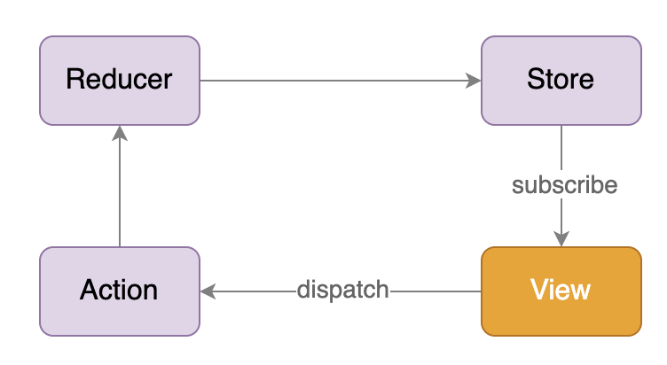
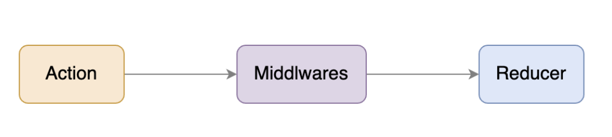
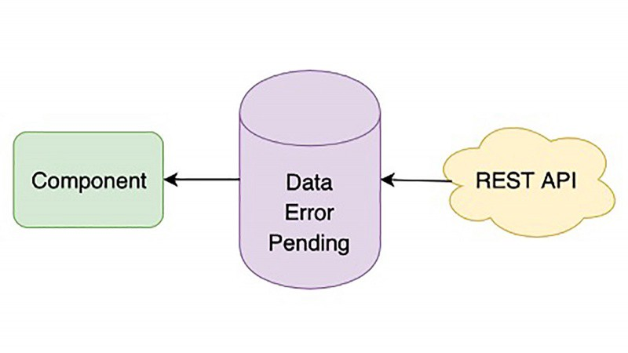

# React Hooks
## Basics
- reusable logic
- single responsibility
### Custom Hooks Scenario
- Extract business logic
- Encapsulate generic logic : useAsync
#### useAsync to encapsulate different request states and expose them to be used by component
```
const useAsync = (asyncFunc)=>{
    const [data, setData] = useState(null); 
    const [loading, setLoading] = useState(false); 
    const [error, setError] = useState(null);
    const execute = useCallback(()=>{
        setLoading(true)
        asyncFunc().then(response=>{
            setData(response)
            setLoading(false)
        }).catch(err=>{
            setLoading(false)
            setError(err)
        })
    },[asyncFunc])
    return {data,loading,error,execute}
}
```
- Listen on browser : useScroll / useCookies / useLocalStorage
- divide complex component into hooks

### Redux
#### Redux Store
- Global unique
- Tree structure

#### Redux Usage
- Share states across components
- Share states across multiple instances from one component

#### Basic Concepts
- state/store, pure JS object
- action, pure js object
- reducer, a function accepts state and action as params, get a new Store from calculation

- Every change for Store should use reducer 
  - Immutable
  - Predictale
  - Easy to track and debug

### React Redux

- In practice, we don't need care about how View is bind to data from Store, react-redux do this for us.

### Redux [Async Action](https://redux.js.org/understanding/thinking-in-redux/glossary#async-action)
- Mainly for processing async logic.
- Async action is not a specific concept,it's a usage of Redux by combining actions to implement async data processing, and without adding any new concept.
- A Redux action can be anything, an object or a function. By using this mechanism, Redux provides redux-thunk as middlware. If the middleware receives a function as a params, it will run this function by passing into dispatch, before passing to reducer. So that you can device when and how to dispatch action.



#### reusabe fetchData by Async Action
- How to fetch data in general way ? 
  - Normally need 3 actions : fetching/loading;fetched/success;fetched/failed;
    - dispatch({ type: 'FETCH_DATA_BEGIN' });
    - dispatch({ type: 'FETCH_DATA_SUCCESS', data: res });
    - dispatch({ type: 'FETCH_DATA_FAILURE', error: err });
  - Combined with 3 selectors
    - const data = useSelectore(state => state.data); 
    - const pending = useSelector(state => state.pending); 
    - const error = useSelector(state => state.error);
```
export const useAsync = (asyncFunc)=>{
    const [data, setData] = useState(null); 
    const [loading, setLoading] = useState(false); 
    const [error, setError] = useState(null);
    const execute = useCallback(()=>{
        setLoading(true)
        asyncFunc().then(response=>{
            setData(response)
            setLoading(false)
        }).catch(err=>{
            setLoading(false)
            setError(err)
        })
    },[asyncFunc])
    return {data,loading,error,execute}
}
```
- Make fetchData(thunk) reusable by Async Action in Redux
  - Set up redux-thunk
  - Create thunk
```
//set up redux-thunk to store
import { createStore, applyMiddleware } from 'redux'
import thunkMiddleware from 'redux-thunk'
import rootReducer from './reducer'

const composedEnhancer = applyMiddleware(thunkMiddleware)
const store = createStore(rootReducer, composedEnhancer)

//create a thunck by hand, combining actions in async function

const fetchData = ()=>(dispatch)=>{
  dispatch({ type: 'FETCH_DATA_BEGIN' }); 
  fetch('/some-url')
    .then(res => { 
        dispatch({ type: 'FETCH_DATA_SUCCESS', data: res }); 
      })
    .catch(err => { 
        dispatch({ type: 'FETCH_DATA_FAILURE', error: err }); 
      })
  }
```
- Async action in react-redux app
  - [Config store which includes middleware](https://redux.js.org/usage/configuring-your-store#the-solution-configurestore)
  - Create thunk
```
// config store
import configureStore from './configureStore'
const store = configureStore()

//Create thunk method 1 : createAsyncThunk
export const incrementAsync = createAsyncThunk(
  'counter2/fetchCount', //action type string
  async (amount) => {
    const response = await fetchCount(amount);
    // The value we return becomes the `fulfilled` action payload
    return response.data;
  }
);

//Create thunk method 2 : create thunk by hand
export const incrementIfOdd = (amount) => (dispatch, getState) => {
  const currentValue = selectCount(getState());
  if (currentValue % 2 === 1) {
    dispatch(incrementByAmount(amount));
  }
};
```

# React Hook Practices
> #### Develop React is actually for developing and managing states in application.
> - Keep states minimum
>   - do not think of state as a variable so that abuse it
>   - should keep it minimum but with completeness
>     - data can be calculated from existing state, we should calculate it as needed, withoiy save the calculate result into some existing state.
>  - steps to think about state
>     1. how many states the entire funtion should have
>       - data from API?
>       - inputs from User?
>       - filtered/processed data based on inputs
>     2. does those states are all necessary ? if there some of them can be get by calculating
> - avoid intermediate state, make sure single data source. Find the correct source of state and ues it directly,without creating extra state. More states interact with each other, more logic to handle them.
> Nature of React is state driven.[state change -> makes UI change](#react-redux)

## Practice : Create custom controlled component in React
<p>React controlled Component</p> : its value determited by passing value, instead of user inputs

```
<input value={value} onChange={handleChange} />
```

<p>
React uncontrolled Component</p>
: it can have its own internal state, its displaying value isn't controled by React.

```
<input onChange={handleChange} />
```
## Practice : handle API request in React
### Create APIClient to handle API calls 
Need implement a resusable API client, instead of calling APIs using fetch/Axios in every single component, which is handy for:
- General Request Headers : Auth token
- Server URL config : API client should be able to choose correct URL depends on env the APP is runing on
- Exception handle :  e.g. UnAuth/Token expire/General Error

Implement API client Based on [Axios](https://github.com/axios/axios) is better then fetch, which has more convinient/readable API, e.g. request interceptor, easier to create multiple instances, keeps code clean.

### Use Hook to wrap GET request by using APIClient
<p>one of features of Hook is we can use hook to "hook" any data source to a React component. GET request is a good example, we can regard response from GET is a remote data source,which can be encapsulated into a hook.</p>

- data : sucessful response data;
- error : failure message;
- pending : after request sending out,before response coming back, in this period, it's pending;

with thiose 3 states, we can easily show loading, error or data.



### Why use hook to wrap every individual GET API request, instead of a general hook, e.g. useRemoteData ?
- We don't have to, but we need keep a hook as simple as possible. 
- General, we need do additional work to process data from API for showing on UI, and every request may have different logic to process, allowing a little bit duplicated code, we can avoid produce too much complex logic. 
- Meanwhile, sometimes we need construct a remote data source by multiple requests, wrap every GET request to individuel hook makes logic more clear.
- One single GET request - one hook only applies to GET request, for other types of request, we can use a general hook follows same methodology as GET hook(encapsulate different states of a request and expose to be used by Component).[See useAsync](#useAsync-to-encapsulate-different-request-states-and-expose-them-to-be-used-by-component)

### handle multiple API request (concurrence and serialization)
Come back to the nature : state drive UI. We can use state change to manage request. Every render provide a chance to do something based on state change. So that we can use different state combination to implement async request.

Consider requirements below:
- Get article details
- Get author's details of article
- Get article comment

Implementation
1. : concurrence and serialization Requests in useEffect
- Get article details and comment are concurrence, as long as get article ID
- Get aritcle details and its author's details as serialization, need get author's ID from article details first
- React function component is sync, we can't use "await", we should useEffect instead.

2. : React Render
- First render only has ID at this time - 2 useEffect to get ariticle details and comments, no authorId yet, not trigger author details api
- After article details coming back, use autherId to fetch auther detaisl in useEffect
- Display author details

Obviously, useEffect above all triggered by data(articleId->articleDetails/articleComment;articleDetails/articleId->authorDetails)
> Summary:怎么从 Hooks 的角度去组织异步请求。
> 首先，我们要定义一个自己的 API Client，封装整个应用中异步请求的一些通过设置，以及统一处理，方便在 Hooks 中使用。
> 然后，我们需要充分利用 Hooks 能让数据源变得可绑定的能力，让一个远程 API 对应的数据成为一个语义化的数据源，既可以把业务逻辑和 UI 展现很好地分开，也有利于测试和维护。
> 最后呢，针对多请求的处理，利用状态的组合变化来实现并发和串行请求。


